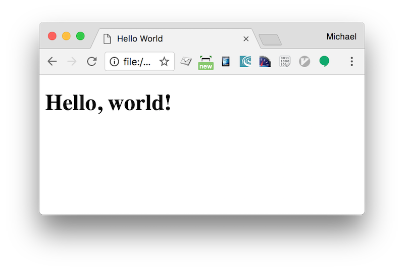

# Exercise 1 - Running React in your browser & Hello World! exercise

## Objectives

1. Learn about JSX syntax
2. Embedding React component in a HTML document

## Steps

1. Create a new file in in this folder with the file name `index.html`. You can use VSCode to do so.
2. Copy and paste this content into `index.html`:

	```html
	<!DOCTYPE html>
	<html>
	  <head>
	    <meta charset="UTF-8" />
	    <title>Hello World</title>
	    <script src="https://unpkg.com/react@16/umd/react.development.js"></script>
	    <script src="https://unpkg.com/react-dom@16/umd/react-dom.development.js"></script>
	    <script src="https://unpkg.com/babel-standalone@6.15.0/babel.min.js"></script>
	    <style>
	    	h1 { font-family: Arial, Helvetica, sans-serif; }
	    </style>
	  </head>
	  <body>
	    <div id="root"></div>
	    <script type="text/babel">
	    	ReactDOM.render(
			  <h1>Hello, world!</h1>,
			  document.getElementById('root')
			);
	    </script>
	  </body>
	</html>
	```
3. Start `http-server`

	```
	http-server
	```

4. Open the website in your browser: [http://localhost:8080](http://localhost:8080).

	

## Note on this method

Note: the method used in this exercise a great way to try React but it's not suitable for production.
It slowly compiles JSX with Babel in the browser and uses a large development build of React.

To set up a production-ready React build environment, follow these instructions:

* [https://reactjs.org/docs/add-react-to-a-new-app.html](https://reactjs.org/docs/add-react-to-a-new-app.html)
* [https://reactjs.org/docs/add-react-to-an-existing-app.html](https://reactjs.org/docs/add-react-to-an-existing-app.html)

You can also use React without JSX, in which case you can remove Babel:

* [https://reactjs.org/docs/react-without-jsx.html](https://reactjs.org/docs/react-without-jsx.html)
* [https://reactjs.org/docs/cdn-links.html](https://reactjs.org/docs/cdn-links.html)

## Further reading

- The official hello world exercise: [https://reactjs.org/docs/hello-world.html](https://reactjs.org/docs/hello-world.html)