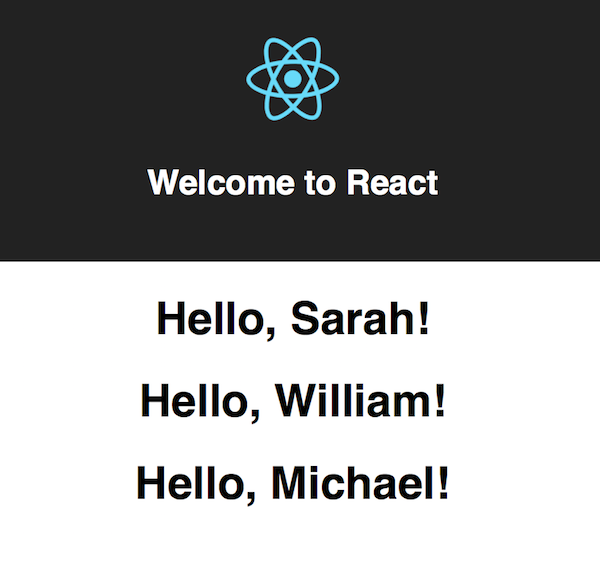
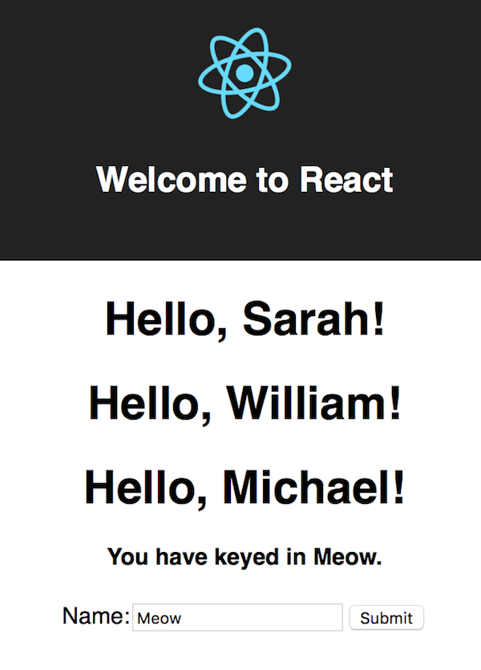

# Exercise 3 - Build a web app using `create-react-app`

## Lesson 1

### Scenario

- Create an empty React app

### Objectives

- Learn how to use a library to build a production ready React App

### Exercises

1. Install `create-react-app`:

	```
	npm install -g create-react-app
	```

2. Create a new app:

	```
	create-react-app my-app
	```
	
3. Start the new app

	```
	cd my-app
	npm start
	```
	
## Lesson 2

### Scenario

- Create a new React component

### Objectives

- Learn about how to create a functional React component
- Use `props` and how to set default values for `props`.

### Exercises

1. Create a new file in the `src` folder with the file name `Welcome.js`

2. Copy and paste this into `Welcome.js`

	```javascript
	import React from 'react'

	const Welcome = (props) => {
		return <h1>Hello, {props.name}!</h1>
	}

	Welcome.defaultProps = {
		name: 'Michael'
	}

	export default Welcome;
	```

3. Edit `App.js` and remove the `<p>` tag. Replace it with the following:

	```javascript
	<Welcome name='Sarah' />
	<Welcome name='William' />
	<Welcome />
	```
	
	Remember to import the component at the top of `App.js`:
	
	```javascript
	import Welcome from './Welcome'
	```

4. The web page should reload automatically. Check the web browser for the updated view.

	
	
## Lesson 3

### Scenario

- Create a form in React

### Objectives

- Use an ES6 class to build a React Component
- Learn about `state` in React
- Learn about event handling in React components

### Exercises

1. Create a new file in the `src` folder with the file name `NameForm.js`

2. Copy and paste this into `NameForm.js`:

	```javascript
	import React from 'react'
	
	class NameForm extends React.Component {
	  constructor(props) {
	    super(props)
	    this.state = {value: ''}
	
	    this.handleChange = this.handleChange.bind(this)
	    this.handleSubmit = this.handleSubmit.bind(this)
	  }
	
	  handleChange(event) {
	    this.setState({value: event.target.value})
	  }
	
	  handleSubmit(event) {
	    alert('A name was submitted: ' + this.state.value)
	    event.preventDefault()
	  }
	
	  renderInfo () {
	    let message = 'Please key in your name.'
	    if (this.state.value) {
	      message = `You have keyed in ${this.state.value}.`
	    }
	
	    return (
	      <h4>{message}</h4>
	    )
	  }
	
	  render() {
	    return (
	      <form onSubmit={this.handleSubmit}>
	        {this.renderInfo()}
	        <label>
	          Name:
	          <input type="text" value={this.state.value} onChange={this.handleChange} />
	        </label>
	        <input type="submit" value="Submit" />
	      </form>
	    )
	  }
	}
	
	export default NameForm
	```

3. Import the component at the top of `App.js`:
	
	```javascript
	import NameForm from './NameForm'
	```

4. Add the component below the `<Welcome />` components

	```javascript
	<Welcome name='Sarah' />
    <Welcome name='William' />
    <Welcome />

    <NameForm />
	```
	
3. The web browser should automatically reload with the updated component

	

## Lesson 4

### Scenario

- Prepare the app for uploading to your website

### Objectives

- Learn how to prepare the React app for production release.

### Exercises

1. Stop the development server by pressing `Ctrl` + `c`

2. Build the app for production to the `build` folder

	```
	npm run build
	```
	
3. Serve the `build` folder using `http-server`:

	```
	http-server ./build
	```
	
4. Open this URL in your browser: [http://localhost:8080](http://localhost:8080)

## Further Readings

- [https://reactjs.org/docs/react-component.html](https://reactjs.org/docs/react-component.html)
- [https://reactjs.org/docs/state-and-lifecycle.html](https://reactjs.org/docs/state-and-lifecycle.html)
- [https://reactjs.org/docs/handling-events.html](https://reactjs.org/docs/handling-events.html)
- [https://reactjs.org/docs/forms.html](https://reactjs.org/docs/forms.html)